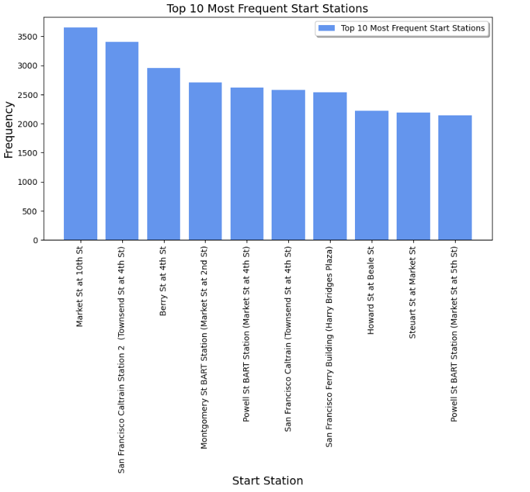

# Project Report

## Team Members

- Faris Alotaibi 
- Omar Alkhnani
- Salman Almalki

## 1. Introduction
### 1.1 Problem
The bike-sharing dataset requires cleaning and preprocessing to address data inconsistencies, missing values, and outliers. The large dataset size poses challenges in terms of efficient processing. The team will utilize Python libraries to analyze and visualize the data, transforming it into a structured format for meaningful insights.

### 1.2 Objective
This project aims to preprocess and analyze a public bike-sharing dataset using Python libraries. The objective is to extract valuable insights through data cleaning, exploration, and visualization, to support decision-making in the bike-sharing service.
## 2. Dataset Overview and Source
The **Ford Go Bike Data** dataset is obtained from a public bike-sharing service. It includes variables such as gender, start time, end time, start station, end station, user type, and more. The dataset represents a sample of bike rides taken over a certain period of time.
The dataset is available on the official website of the bike-sharing service or through data repositories such as Kaggle or the company's data portal.

## 3. Final Ten Insights

### 1. What are the top 10 most frequent start stations?
   
### 2. What are the top 10 most frequent end stations?
   
### 3. What is the percentage distribution of bike users based on their user types?
   
### 4. What is the percentage distribution of gender among the users?
   
### 5. How does the duration of bike trips vary with age for different genders?
   
### 6. What is the distribution of daily bike rides across different weekdays
   
### 7. Is there any relationship between the age of bike users and the duration of their trips?
   
   
### 8. What is the distribution of bike users based on their user types?
   
   
### 9. What is the count of different gender groups based on their bike share trip combinations?
   
   
### 10. Does the trip duration vary across different months?

## 4. Conclusion
The project analyzed Ford Go Bike Data using Python libraries for data preprocessing and visualization. Valuable insights were derived through cleaning and exploratory analysis, providing a basis for informed decision-making in the bike-sharing service.

