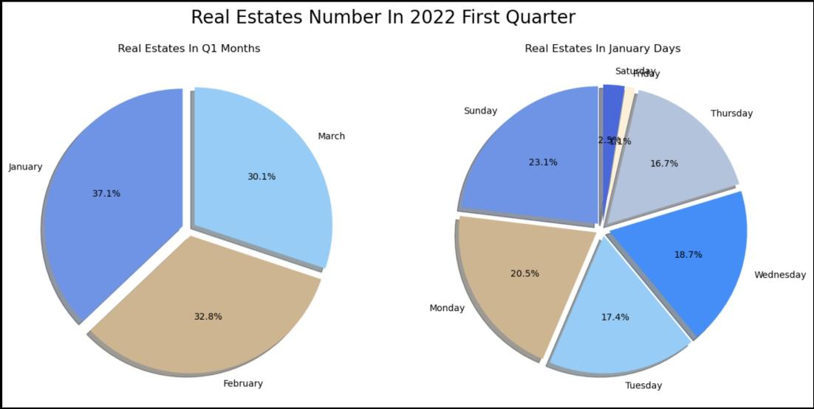
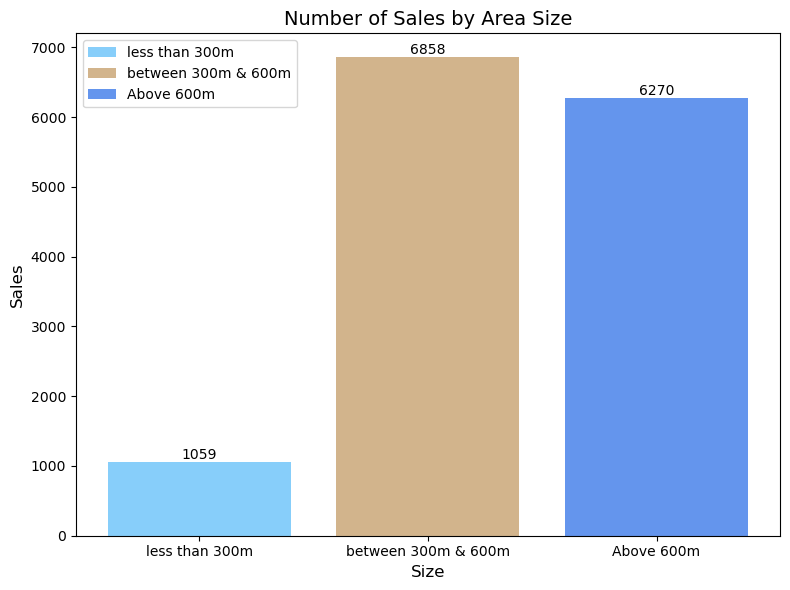
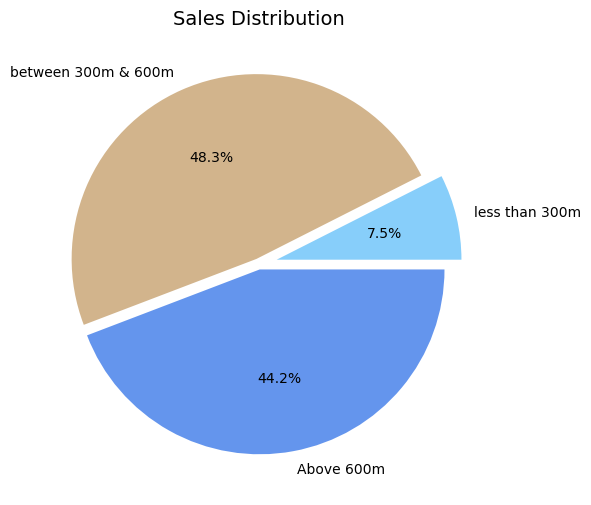
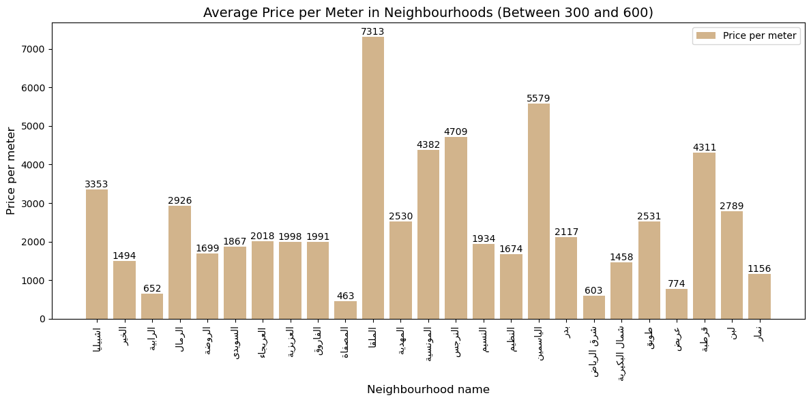
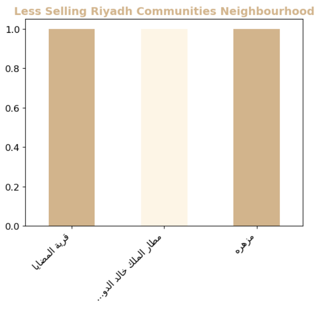
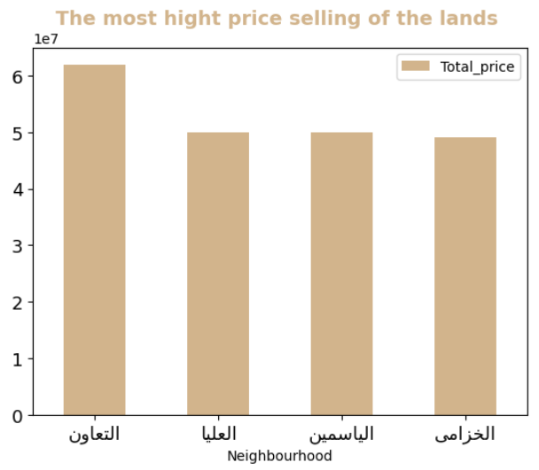

## Team members:
- Amjad Alsuwaiket
- Majed Alshnifi
- Zainab Melaibari

# Introduction to the Real Estate Database

The Real Estate Database provides valuable insights into the real estate market in Riyadh. This analysis aims to explore the dataset, understand key trends, and derive meaningful insights to aid decision-making and provide a comprehensive understanding of the market.
### Problem Statement

The real estate market in Riyadh is highly competitive and dynamic. Understanding the market trends, sales distribution, and pricing patterns is crucial for buyers, sellers, and investors. This analysis aims to answer important questions related to sales distribution, land area preferences, and neighborhood pricing, enabling stakeholders to make informed decisions.

### Objectives

1. Identify the sales distribution over the first quarter of 2022.
2. Analyze the relationship between land area and sales.
3. Determine the most desired land area range and its sales distribution by neighborhood.
4. Explore the average price per meter in different neighborhoods.
5. Provide insights to support decision-making in the real estate market.

## Dataset Overview

The dataset comprises real estate information for the first quarter of 2022 in Riyadh. It includes data on prices per meter, land sizes, neighborhood names, and total prices. The dataset was sourced from the [Ministry of Justice](https://www.moj.gov.sa/ar/opendata/bi/birealestate/Dashboards/100_kpiDistrict/101_Monthly/kpi101_04.aspx#), ensuring its reliability and accuracy.

## Exploratory Data Analysis (EDA)

In order to gain insights and understand the dataset, we performed Exploratory Data Analysis (EDA) using various steps and techniques. The following are the steps we followed:

1. **Head**: We started by examining the first few records in the dataset using the `head` function. This allowed us to get a glimpse of the data and understand its structure.

2. **Shape**: We explored the shape of the dataset using the `shape` attribute, which provided us with the number of rows and columns in the dataset. This information helped us understand the overall size of the dataset.

3. **Info**: We used the `info` function to obtain information about the dataset, including the data types of each column, the number of non-null values, and the memory usage. This helped us understand the data types and identify any potential data inconsistencies.

4. **Describe**: By utilizing the `describe` function, we obtained summary statistics for numerical columns in the dataset. This allowed us to gain insights into the distribution, central tendency, and spread of the numerical data.

5. **Missing Values**: We examined the presence of missing values in the dataset by using the `isnull` function and summing the null values. This step helped us identify any missing data and determine the extent of data completeness.

6. **Additional EDA**: Based on the specific needs of the dataset, we conducted additional EDA steps. This could include a exploring categorical variables, and addressing outliers or data inconsistencies.

By following these EDA steps, we were able to gain a comprehensive understanding of the real estate dataset and extract valuable insights that could be used for further analysis and decision-making.

# Data Visualization

In this section, we present meaningful insights obtained through data visualization techniques. We have used various charts to analyze the real estate dataset and provide valuable insights.

## Real Estates Number In 2022 First Quarter

To represent the number of real estate in each month of the first quarter of 2022, we plot a Pie Chart that shows the number of real estate for the first three months: 'January', 'February', and 'March'. Also, based on the month that has the maximum number of real estate, we plot another Pie Chart that shows the number of real estate on each day of that month. These charts help to build an intuition about the best selling time for real estate in 2022.

    

## Sales Distribution over the First Quarter by Land Area

To understand the sales distribution over the first quarter based on the area of the land, we created a bar chart that compares the number of sales for three different land area categories: 'less than 300m', 'between 300m & 600m', and 'above 600m'. The chart provides a visual representation of the sales distribution, allowing us to identify any trends or variations among the land area categories.

    

## Pie Chart of Land Area Distribution

To visualize the percentage distribution of land area categories in the dataset, we created a pie chart. The chart illustrates the proportion of 'less than 300m', 'between 300m & 600m', and 'above 600m' land areas, providing an overview of the distribution.

    

## Sales Distribution by Neighbourhood for Land Area between 300m and 600m

To analyze the sales distribution within the desired land area range of 300m to 600m, we created a bar chart that breaks down the sales by neighborhood names. This chart provides insights into the distribution of sales within this specific land area range for different neighborhoods in Riyadh.

    

## Sales Distribution by Neighbourhood for Land Area above 600m

Similar to the previous analysis, we created a bar chart to examine the sales distribution by neighborhood for land areas above 600m. This chart allows us to compare the sales performance of different neighborhoods within this land area range.

    

## Average Price per Meter in Neighbourhoods (Above 600)

To determine the average price per meter in different neighborhoods for land areas above 600m, we created a bar chart. This chart provides insights into the pricing trends and helps identify neighborhoods with higher or lower average prices per meter.

    

## Average Price per Meter in Neighbourhoods (Between 300 and 600)

To analyze the average price per meter in different neighborhoods for land areas between 300 and 600, we created a bar chart. This chart allows us to compare the pricing trends among neighborhoods within this land area range.

    

## Additional Charts and Insights

In addition to the specific questions mentioned above, we have generated several other charts to drive meaningful insights from the real

## Top Selling Riyadh Communities

The top-selling community in the Riyadh with 28,538 sales.

    

## Less Selling Riyadh Communities

The scale analysis show less selling lands at Jan , Feb and Mar

    

## The most hight price selling of the land

The scale analysis show all the neighbourhood in riyadh with the higst price 

    

# Real Estate Insights for the First Quarter of 2022 in Riyadh

The real estate dataset for the first quarter of 2022 in Riyadh provides valuable insights into the market trends and sales distribution.

- The sales distribution over the first quarter shows variations among different months, with January having the highest number of real estate sales.

- The majority of land areas in the dataset fall under the category of 'less than 300m', followed by 'between 300m & 600m', and 'above 600m'.

- Within the desired land area range of 300m to 600m, different neighborhoods in Riyadh show varying sales distributions.

- For land areas above 600m, certain neighborhoods stand out with higher sales volumes compared to others.

- The average price per meter in neighborhoods with land areas above 600m varies, indicating pricing differences in different areas of Riyadh.

- The average price per meter in neighborhoods with land areas between 300m and 600m also shows variations, reflecting the impact of location and land size.

- The top-selling community in Riyadh recorded 28,538 sales, indicating its popularity and market demand.

- Some neighborhoods in Riyadh had lower sales volumes during the first quarter, suggesting potential opportunities for buyers or investors.

- The analysis identified neighborhoods with the highest-priced land, highlighting areas where premium properties are located.

These insights provide valuable information for stakeholders in the real estate market, enabling them to make informed decisions based on sales distribution, land area preferences, and pricing patterns in different neighborhoods of Riyadh.

## Conclusion

The analysis of the real estate dataset for the first quarter of 2022 in Riyadh reveals important insights about the market. By examining the sales distribution, land area preferences, and pricing patterns, stakeholders in the real estate industry can make informed decisions and capitalize on opportunities. Here are the key findings:

1. **Sales Distribution**: The sales distribution varies across different months, with March experiencing the highest number of real estate sales. This information helps stakeholders understand the market dynamics and plan their strategies accordingly.

2. **Land Area Preferences**: The majority of the land areas in the dataset fall under the category of 'less than 300m'. Understanding the prevalent land area preferences provides valuable insights for developers, investors, and buyers in aligning their offerings with market demand.

3. **Neighborhood Sales**: The analysis highlights the variations in sales distribution among different neighborhoods within the desired land area range of 300m to 600m. This information can guide stakeholders in identifying neighborhoods with higher sales potential and adjusting their marketing and investment strategies accordingly.

4. **Pricing Patterns**: The average price per meter varies in neighborhoods with land areas above 600m and between 300m and 600m. This reflects the influence of location and land size on property prices. Stakeholders can leverage this information to assess the value of properties and negotiate prices effectively.

5. **Top-Selling Community**: The identification of the top-selling community in Riyadh with 28,538 sales emphasizes its popularity and market demand. This insight can be valuable for buyers and investors looking to invest in high-demand areas.

6. **Potential Opportunities**: The lower sales volumes in certain neighborhoods during the first quarter indicate potential opportunities for buyers or investors. These areas may offer attractive pricing, making them suitable for those seeking investment prospects or affordable properties.

7. **Premium Property Locations**: The analysis identifies neighborhoods with the highest-priced land, indicating the presence of premium properties. This insight can guide stakeholders interested in luxury or high-end real estate.

In conclusion, the real estate insights derived from the first quarter of 2022 dataset in Riyadh provide valuable knowledge for stakeholders in the market. By leveraging these insights, buyers, sellers, investors, and developers can make well-informed decisions, optimize their strategies, and navigate the dynamic real

